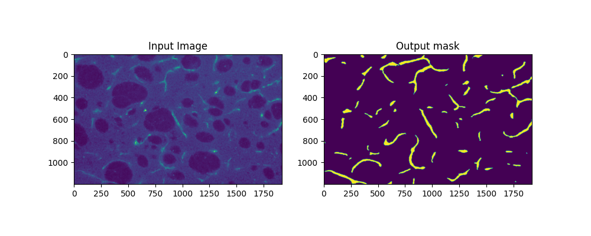
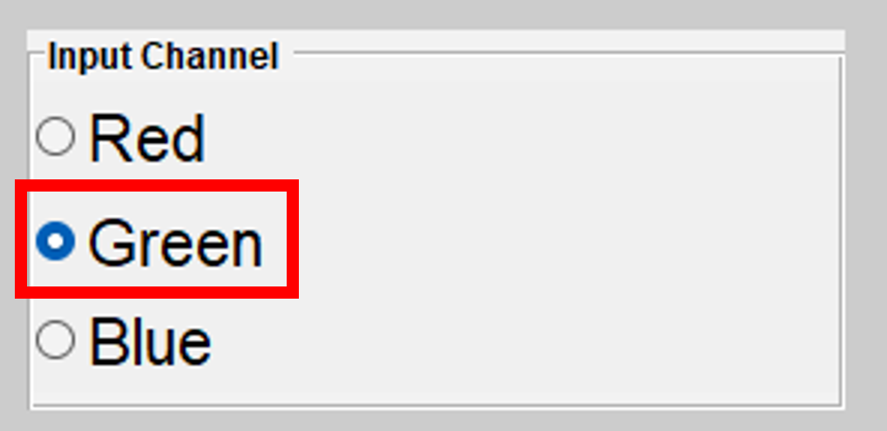

# Blood Vessels Segmentation
This repository contains the code for blood vessel segmentation in microscope images,
along with instructions for running both segmentation and training on new datasets.

## Segment New Images
To segment new microscope images, follow these steps:
1. Download the folder **'output'** from: https://drive.google.com/drive/u/1/folders/1YkBGUMTwwCndmApko3rBT6-AFgIq8AUL
   to the main repository. (blood_vessels_segmentation\output)
 
2. Run the following command in the terminal:
    >python predict.py --model <default=20230512_165741> --data_dir <data_dir> --threshold <default=0.3>

    This will generate predictions for the images, which will be saved in data_dir. The mask will be saved as mat files 
   with the name: 'image_name_BW.mat'.

To process the segmented images in EBreaverApp:
3. Open **'EBreaverApp'** --> **'open REAVER GUI for segmentation'** and choose **'Green'** in 'Input channel'
    
   

4. **'Data'** --> **'Automatic Segmentation'** and continue with the usual workflow.

   

## Training
To train a new model on your own dataset, follow these steps:

### Date Preparation

1. Create the following folders in dataset: **'raw_data'**, and **'train'**.
2. Copy the folders to be processed (for example: **'RG11 - MB 175'**) to **'dataset/raw_data'**.
These folders should contain the original images (**'.tiff)'**, the masks (**'.mat'**), and
User Verified Table (**'.mat'**).
3. Run the Matlab file:
   >extract_data.m
 
This will create two new folders in **'train'**: **'images'** and **'masks'**.

### Train
Run the following command in the terminal:
   > python main.py --train True --epochs <num_epochs> --batch_size <batch_size>

This will train the model, and after training is finished, the models and
training metrics plots will be saved in **"outputs/<training_name>/'**.

### Test
Run the following command in the terminal:
   >python main.py --test True --model <model_name>.

This will test the model, and the results will be saved in **'outputs/<training_name>/test_plots/'**.

